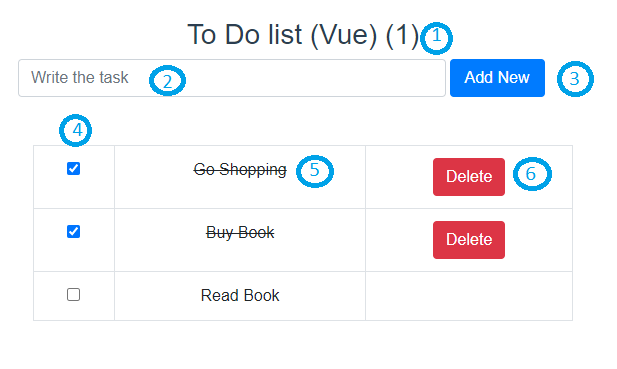

# todo-vue

## Project setup
```
npm install
```

### Compiles and hot-reloads for development
```
npm run serve
```

### Compiles and minifies for production
```
npm run build
```

### Lints and fixes files
```
npm run lint
```

### Customize configuration
See [Configuration Reference](https://cli.vuejs.org/config/).


# To-Do-List(Vue)



## Demo Link
```
https://khinezinthaw7.github.io/todo-vue
```
- [todo-vue](#todo-vue)
  - [Project setup](#project-setup)
    - [Compiles and hot-reloads for development](#compiles-and-hot-reloads-for-development)
    - [Compiles and minifies for production](#compiles-and-minifies-for-production)
    - [Lints and fixes files](#lints-and-fixes-files)
    - [Customize configuration](#customize-configuration)
- [To-Do-List(Vue)](#to-do-listvue)
  - [Demo Link](#demo-link)
  - [Unfinish task count](#unfinish-task-count)
  - [Text Input Field](#text-input-field)
  - [Add New Button](#add-new-button)
  - [Done Checkbox](#done-checkbox)
  - [Task Title](#task-title)
  - [Delete Button](#delete-button)

## Unfinish task count

This is the count for unfinish task.
## Text Input Field

This is the text field to fill your task.

## Add New Button

The button is to add new task and store to localstorage.

## Done Checkbox

The task is done when click the checkbox.

## Task Title

This is the task title.
## Delete Button

This button is to delete the task.
